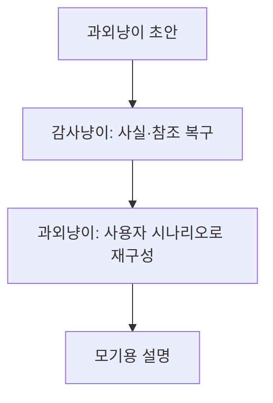

# 2026-08-21 세션 01 — PR #524 story-first와 대화 원문 보존

## Turn 01

### 모기

~~~text
안녕 난 모기라옹ㅋ
~~~

### 과외냥이

~~~text
안녕 모기라옹ㅋ

학습 인수인계: 2026-08-20-learning-observation-cumulative-review.md 읽음

- PR 카드: `2026-08-19-pr524-representative-manual-curation.md`
- 설계 카드: `2026-08-14-swatch-media-self-preservation-design.md`
- 코드 학습 노트: `2026-08-21-pr524-relation-vs-url-fallback.md`

어느 카드부터 볼까?
~~~

## Turn 02

### 모기

~~~text
좋아 그 내가 최근에 '감사냥이'라는 서브에이전트(모기머가리병목-작업기억-바인딩-해결시스템) 시스템을 만들었다옹 아냐옹?
~~~

### 과외냥이

~~~text
응, 알아옹. 지금 인수받은 규칙에는 **‘감사냥이’가 코드 학습 노트의 참조 완결성을 독립 점검하는 서브에이전트**로 들어 있어.

여러 파일·테이블의 상태 전이를 다룬 노트를 만들거나 크게 고치면, 감사냥이가 정확한 SHA의 실제 소스와 초안을 읽고 다음을 확인해:

- 파일 역할 지도와 예시 상태
- 상태 전이와 층간 연결
- `모기 박스`
- 한 줄 요약의 근거
- 빠진 참조나 소스 근거

감사냥이는 직접 수정하지 않고 `누락 / 최소 교체안 / 미확인`만 보고하고, 과외냥이가 소스와 다시 대조한 뒤 확인된 것만 반영해. 현재는 3회짜리 파일럿으로 알고 있어.

다만 **‘모기머가리병목-작업기억-바인딩-해결시스템’이라는 더 큰 전체 시스템의 설계**까지 내가 읽은 건 아니고, 그중 `감사냥이`에 해당하는 참조 완결성 감사 규칙만 정확히 인수받았어. 둘이 같은 시스템을 말하는 거야?
~~~

## Turn 03

### 모기

~~~text
맞다옹! 둘이같은거라옹 근데 ㅠ mogi-cards/code-diff-notes/2026-08-21-pr524-manual-set-clear-flow.md 이거 감사냥이 처음 적용해본거라옹. 근데 흠. 바뀐후가 더 힘들어 약간 과하게..적용된것같아 특히 2번 소제목 부분 보면 4개 마이그를 설명해놓은부분이 진짜 와우. 와우....ㅋㅋㅋㅋ 일단 이부분만 대충 읽고와줘 뭐 하진말고
~~~

### 과외냥이

~~~text
읽고 왔어. 아무것도 수정하지 않았어.

2번은 전체 10개 파일을 펼친 직후, 핵심길의 네 파일인 `migration SQL → repo → UI → fixture SQL`을 각각 여러 상태 변화까지 압축해서 설명해놨네. 왜 “와우…”라고 했는지 느낌 왔어. 일단 여기까지만 알고 기다릴게.
~~~

## Turn 04

### 모기

~~~text
일단 챗지피티 피드백 원문이라옹 "ㅋㅋㅋㅋ 괜찮아. **감사냥이는 사실 누락을 고쳤지만, 그 결과는 여전히 사람용 설명이 아니라 구현 명세서야.** 모기가 지금 읽어야 할 핵심은 사실 이것뿐임.

> 어드민이 `a2.jpg`를 대표로 고르면 화면 대표가 `a2.jpg`로 바뀐다.
> 어드민이 수동 지정을 해제하면 시스템이 자동 규칙을 다시 돌려 `a1.jpg`를 대표로 고른다.

끝. 나머지는 이 이야기가 코드의 어디에서 일어나는지를 증명하는 내용이야.

### 실제 흐름

**1. 어드민이 `a2.jpg`를 대표로 선택한다**

1. 화면의 `onPick()`이 실행된다.
2. 선택한 호수 ID와 `a2.jpg`의 미디어 ID를 서버에 보낸다.
3. DB는 기존 대표 행을 없앤다.
4. `a2.jpg`를 가리키는 새 대표 행을 만든다.
5. 그 행에 “어드민이 수동으로 선택함”이라는 `manual` 표시를 붙인다.
6. 화면을 새로 조회하면 `a2.jpg`가 대표로 보인다.

**2. 어드민이 수동 대표를 해제한다**

1. 화면의 `onClear()`가 실행된다.
2. DB는 현재 대표가 `manual`로 선택된 행인지 확인하고 없앤다.
3. 자동 대표 선정 로직을 다시 실행한다.
4. 자동 규칙이 `a1.jpg`를 대표로 고른다.
5. 화면을 새로 조회하면 `a1.jpg`가 대표로 보인다.

**3. 테스트가 확인하는 것**

* 지정 후: 대표는 `a2.jpg`, 선정 방식은 `manual`
* 해제 후: 대표는 `a1.jpg`, 선정 방식은 `auto_single`
* `reselected=true`: 해제 후 자동 대표를 다시 골랐다는 뜻

용어도 이렇게만 잡으면 돼.

| 용어                                  | 여기서의 역할                       |
| ----------------------------------- | ----------------------------- |
| `media_id`                          | 어떤 사진인지 가리키는 ID               |
| `shade_images`의 `is_primary=true` 행 | 현재 대표사진을 기록한 행                |
| `representative_source=manual`      | 어드민이 직접 고른 대표                 |
| `representative_source=auto_single` | 시스템이 자동으로 고른 대표               |
| 지정 RPC                              | 수동 대표로 바꾸라는 서버 명령             |
| 해제 RPC                              | 수동 대표를 없애고 자동 선정을 복구하라는 서버 명령 |
| `refresh()`                         | 변경 후 대표사진을 다시 조회해 화면을 갱신      |

감사냥이 출력이 여전히 힘든 이유도 명확해.

* 사용자 시나리오 없이 파일명부터 등장함
* 중요한 이야기와 함수 이름이 같은 중요도로 나열됨
* 한 문장에 삭제·삽입·조건·호출이 함께 들어감
* `a1`, `a2`, `v_m_a2` 같은 테스트용 이름이 개념 이해를 방해함
* “자동 사다리”가 무슨 규칙인지 정의하지 않음
* 전체를 읽은 뒤에야 **‘아, 선택하면 a2고 해제하면 a1이구나’**를 역산할 수 있음

그러니까 감사냥이는 실패한 게 아니야. **감사용 중간 산출물을 모기에게 그대로 노출한 게 문제**야.

파이프라인은 이렇게 잡는 게 맞아.



과외냥이에게 이 규칙을 추가하면 돼.

> 감사냥이 결과는 최종 학습 자료가 아니라 사실 근거로만 사용한다.
> 최종 설명 첫머리에는 함수명과 파일명을 쓰지 말고, 사용자가 무엇을 누르면 화면이 어떻게 바뀌는지를 2~3문장으로 설명한다.
> 그다음 `수동 지정`과 `해제 후 자동 복귀`를 별도 흐름으로 나눈다.
> 파일명·RPC 이름·테스트 변수는 마지막 근거 구역에 배치한다.

별도의 세 번째 에이전트를 또 추가할 필요는 아직 없어 보여. **감사냥이는 좁은 검증 업무를 하고, 최종 답변의 소유자인 과외냥이가 감사 결과를 학습용 이야기로 합성**하면 돼. 공식 OpenAI 문서에서도 이런 구조는 관리자가 최종 응답을 책임지고 전문 에이전트를 제한된 보조 기능으로 쓰는 패턴에 해당해. [Orchestration and handoffs](https://developers.openai.com/api/docs/guides/agents/orchestration)

그리고 지금 피곤한 건 맞을 수 있지만, 이 원문은 안 피곤한 모기에게도 꽤 비싼 설명이다옹ㅋㅋㅋ **오늘 기억할 건 `a2 수동 지정 → 해제 → a1 자동 복귀` 하나면 충분함.**
" 나도 이 피드백에 동의?하는것같다옹 과하게 사람용설명(의미만있음) -> 과하게 구현명세서ㅠㅇ(의미가 다 사라짐;; ) 이렇게 되었다고 느꼈다옹
~~~

### 과외냥이

~~~text
응, 나도 그 피드백에 동의해. 더 정확히 말하면 **감사냥이는 사실 완결성은 높였지만, 과외냥이가 그 결과를 사람용 설명으로 다시 편집하지 않아서 전체 시스템이 과보정된 것** 같아.

특히 2번에서 실제로는 “마이그레이션 4개”가 아니라 `마이그레이션 → repo → UI → 테스트`라는 서로 다른 네 파일을 설명하고 있어. 그런데 읽을 때 전부 거대한 구현 덩어리처럼 느껴졌다는 것 자체가 문제를 잘 보여줘. 각 파일의 사실은 들어왔지만, 그 파일들이 증명하는 **사용자 관점의 사건**이 앞에서 사라졌거든.

핵심 구분은 이거야.

- 감사냥이의 기준: 빠진 파일·상태·근거가 없는가
- 모기용 설명의 기준: 그래서 사용자가 무엇을 했고 화면에서 무엇이 바뀌는가
- 현재 문서: 첫 번째 기준을 통과한 내용을 거의 그대로 두 번째 결과물로 사용함

그래서 `a2 수동 지정 → 해제 → a1 자동 복귀`가 본문 맨 앞의 중심이어야 하고, 파일명·RPC·테스트 변수는 “이 설명이 맞다는 근거를 보고 싶을 때” 내려가서 보는 층이어야 맞아. 세부 내용을 버리는 게 아니라 **의미 아래로 내려놓는 것**이지.

그러니까 네 표현대로 정말:

> 과하게 의미만 있는 설명 → 과하게 구현만 있는 명세서

로 반대편 끝까지 흔들린 상태야. 감사냥이를 없애거나 세 번째 에이전트를 붙일 문제라기보다, **감사 결과는 내부 근거이고 최종 편집권은 과외냥이에게 있다**는 경계를 추가하면 될 것 같아.

지금은 수정하지 않고, 이 판단만 기억해둘게. 네가 원하는 중간점은 “먼저 사용자 사건을 이해하고, 필요할 때만 아래에서 구현 근거를 확인하는 문서”에 가까운 거지?
~~~

## Turn 05

### 모기

~~~text
내가 원문보낸 이유는 흠. 감사냥이 시스템ㅇ 규칙 문서를 수정하길 바라서라옹
~~~

### 과외냥이

~~~text
수정하고 커밋했어.

- [파일럿 규칙](/home/mogi/code/swatch/mogi-cards/harness/pilots/2026-08-21-reference-completeness-audit.md:72)에 `감사 결과는 사실 근거일 뿐 최종 학습 자료가 아니다`라는 경계를 추가했어.
- 최종 문서는 `사용자 사건 2~3문장 → 이벤트별 흐름 → 마지막 구현 근거` 순서로 과외냥이가 다시 합성하게 했어.
- 첫 회차의 과보정과 모기의 실제 독해 마찰도 실행 기록에 남겼어.
- [세션 시작 규칙](/home/mogi/code/swatch/mogi-cards/guide-tutor-preamble.md:54)에도 같은 원칙을 반영했어.
- 별도의 세 번째 에이전트는 추가하지 않도록 명시했어.

커밋: `1cb26fc docs: keep audit output human-centered`

`git diff --check`도 통과했어. 기존 `SCRATCHPAD.md`와 PR 카드의 모기 변경은 건드리거나 커밋하지 않았어.
~~~

## Turn 06

### 모기

~~~text
좋다옹. 그럼 네가 mogi-cards/code-diff-notes/2026-08-21-pr524-manual-set-clear-flow.md 이 파일을 모기 맞춤형으로 수정해달라옹. 아니 수정하지말고 비교해야되니까 하나 더 만들어줘
~~~

### 과외냥이

~~~text
비교용 모기 맞춤본을 새로 만들었어.

[2026-08-21-pr524-manual-set-clear-flow-story-first.md](/home/mogi/code/swatch/mogi-cards/code-diff-notes/2026-08-21-pr524-manual-set-clear-flow-story-first.md)

구조는 이렇게 바꿨어.

- 먼저 `a2 수동 지정 → 해제 → a1 자동 재선정`
- 다음에 화면에서 일어나는 두 사건
- 그다음 실제 DB 행 변화
- 함수명·파일명·raw diff·테스트는 5번 이후 근거층
- 전체 변경 파일은 접을 수 있게 배치
- 원본 노트는 수정하지 않음

감사냥이도 적용했어. 감사 과정에서 “지정 전부터 `a1`이었다”는 건 테스트가 직접 확인하지 않는다는 점을 잡아서 추측을 제거했고, 기술적인 보강은 근거층에만 넣었어. 파일럿은 `2/3회 완료`로 기록했어.

커밋: `3b376e3 docs: add story-first pr524 learning note`

문서 diff 점검도 통과했고, 모기의 기존 `SCRATCHPAD.md`와 PR 카드 변경은 건드리지 않았어.
~~~

## Turn 07

### 모기

~~~text
mogi-cards/code-diff-notes/2026-08-21-pr524-manual-set-clear-flow-story-first.md 엇 이거 열어서봤는데. orca에서 머 html, mdx, jsx 가 포함되어있어서 그냥 소스코드뷰(원본뷰)로 보인대ㅠ 마크다운으로 보이게하려면 어카냐옹
~~~

### 과외냥이

~~~text
고쳤어. 원인은 `<details>`와 `<summary>` HTML 태그였어. Orca가 그걸 보고 HTML/MDX 문서로 판정한 것 같아.

[비교본](/home/mogi/code/swatch/mogi-cards/code-diff-notes/2026-08-21-pr524-manual-set-clear-flow-story-first.md:23)을 순수 마크다운 제목과 목록으로 바꿨고, HTML 태그가 하나도 남지 않은 것도 확인했어. Orca에서 파일을 닫았다 다시 열면 마크다운으로 보여야 해.

커밋: `8bab675 docs: keep story-first note pure markdown`
~~~

## Turn 08

### 모기

~~~text
좋아 아 그리고 내가 요즘 너무 하네스설계만하긴하는데.. 이제 대화 원문도 보존을 하려고 하거든. 이거는 너한테 어려운 작업은 아니겠지?!?! 걍 머 루트에 raw디렉토리만들고 거기에 머 2026-08-21-1어쩌구. 하루에도 1번이상 세션 로테이션되니까 걍 번호붙이거나 아니다. 걍 세션에서 작업한걸 slug로넣는게나을듯 근데 순서는 알아야되니까 날짜-번호(1씩증가)-slug 이렇게할수있냐옹?ㅋ
~~~

### 과외냥이

~~~text
응, 이건 어렵지 않아. 별도 하네스까지 만들 필요도 없고 단순한 저장 규칙이면 충분해.

파일명은 이게 좋아 보여.

```text
raw/2026-08-21-01-pr524-story-first-rewrite.md
raw/2026-08-21-02-raw-conversation-policy.md
raw/2026-08-22-01-next-topic.md
```

규칙은:

- 날짜가 바뀌면 번호를 `01`부터 다시 시작
- 같은 날짜의 기존 파일 중 가장 큰 번호에 `1`을 더함
- `slug`에는 그 세션에서 실제로 다룬 작업을 넣음
- 사용자와 과외냥이의 사용자-visible 대화를 표현 수정 없이 그대로 저장
- 시스템 지시, 숨은 추론, 도구 출력은 제외
- 세션 종료 때 한 번 저장하고 커밋
- `raw/`는 과외 재료 목록과 `reviewed` 관리 대상에서 제외

본문도 단순하게 역할과 원문만 두면 돼.

```md
# 2026-08-21 세션 02 — raw conversation policy

## 모기

좋아 아 그리고 내가 요즘...

## 과외냥이

응, 이건 어렵지 않아...
```

번호를 두 자리로 쓰면 파일명 정렬만으로 하루 세션 순서도 바로 보여. 이번 세션부터 원문을 저장할까, 아니면 다음에 새로 여는 세션부터 시작할까?
~~~

## Turn 09

### 모기

~~~text
ㅇㅇ 근데 컴팩트도 고려해야되냐옹?
~~~

### 과외냥이

~~~text
응. **원문 그대로 보존하려면 컴팩트를 고려해야 해.** 세션 끝에 한꺼번에 쓰려고 하면, 컴팩트 이전 대화가 요약으로 바뀌어 정확한 문장을 복원하지 못할 수 있어.

가장 안전한 순서는 이거야.

1. 가능하면 Orca가 보관한 실제 세션 로그를 원문 SSOT로 내보낸다.
2. 그 기능을 쓸 수 없다면, 대화가 오갈 때마다 현재 `raw/...md`에 원문을 누적한다.
3. 세션 종료 때 파일명 slug를 확정하고 한 번 커밋한다.
4. 이 파일은 컴팩트 복구용 체크포인트로 읽지 않고, 순수 보존 기록으로만 둔다.

즉 `세션 종료 때 기억으로 재구성`하면 raw가 아니고, **컴팩트 전에 외부 파일에 도착한 문장만 진짜 raw**라고 보는 게 맞아.

다만 저장 범위를 먼저 정해야 해. 모기의 메시지와 내 최종 답변만 보존할지, 작업 중간에 보내는 진행 메시지까지 전부 보존할지에 따라 기록 빈도가 달라져. 나는 원문 보존이라면 **모기 메시지 + 사용자에게 보인 모든 과외냥이 메시지**를 남기는 쪽이 맞다고 봐.
~~~

## Turn 10

### 모기

~~~text
뭐여. 흠. orca에 그런기능도있어? 알아보라옹
~~~

### 과외냥이

~~~text
확인해보니 **현재 Orca 1.4.186에는 대화 원문을 구조화해서 내보내는 공개 기능이 없어.** 내가 아까 “가능하면 Orca 로그를 내보내자”고 말한 건 확인 전 가정이었어.

실측 결과:

- 공개 CLI 명령에 `conversation export`, `session transcript` 같은 기능 없음
- `terminal read`는 존재함
- 하지만 실제로 읽어보니 대화 데이터가 아니라 **터미널 화면 출력**이야
- 진행 표시, 승인창, 줄바꿈 깨짐, 중복 렌더링 등이 섞이고 일부는 축약됨
- 터미널이 살아 있는 동안의 보조 복구 자료로는 쓸 수 있지만, 깨끗한 대화 원문 SSOT로는 부적합함

그러니까 지금 기준으로는:

```text
Orca 자동 원문 export: 없음
Orca terminal read: 지저분한 PTY 화면 기록
정확한 raw 보존: 에이전트가 컴팩트 전에 파일에 누적해야 함
```

내부 capability에는 `aiVault`와 세션 경계 관련 항목이 보이지만, 공개 CLI에는 내용을 읽거나 내보내는 명령이 없었어. 숨은 내부 저장소를 직접 파는 방식은 버전이 바뀌면 깨질 수 있으니 쓰지 않는 게 맞아.

결론적으로 `raw/날짜-번호-slug.md`를 만들려면 **각 대화 턴을 파일에 누적하고 세션 종료 때 커밋하는 단순 방식**이 현재로서는 제일 확실해.
~~~

## Turn 11

### 모기

~~~text
그러면은 흠. 흠... 그냥 간단한 방식은 한 3~4턴마다 네가 계속 파일하나에다가 append하는거 아닐까?냥?
~~~

### 과외냥이

~~~text
응, 그게 제일 단순하고 현실적이야. **3턴마다 같은 세션 파일에 이어 쓰고, 종료·세션 로테이션 직전에는 남은 턴을 전부 flush**하면 돼.

나는 이렇게 잡는 게 좋아 보여.

- 1턴 = 모기 메시지 1개 + 과외냥이 최종 답변 1개
- 3턴이 완성될 때마다 `raw/날짜-번호-slug.md`에 append
- 각 묶음은 `## Turn 01`, `## Turn 02`처럼 번호를 붙여 중복 저장 방지
- 중간 작업 알림·도구 출력은 제외하고 실제 문답만 원문 그대로 보존
- 모기가 `종료`, `로테이션`, `새 세션`을 말하면 3턴 미만이어도 즉시 저장
- raw 파일은 컴팩트 복구에 읽어 넣지 않는 순수 보존 기록

```md
## Turn 01

### 모기

원문 그대로

### 과외냥이

최종 답변 그대로
```

완벽한 무손실만 따지면 매 턴 저장이지만, 최근 1~2턴은 보통 컴팩트 뒤에도 남으니 **3턴 단위가 번거로움과 보존성 사이의 괜찮은 타협**이야. 이건 rolling checkpoint가 아니라 기록 보관이라 현재 native compaction 관찰과도 목적이 달라.

그럼 `3턴마다 append + 종료 직전 잔여분 flush + 모기/최종답변만 보존`으로 규칙을 만들면 될 것 같아.
~~~

## Turn 12

### 모기

~~~text
3턴 진짜괜찮아? 비용많이드는건 아니겠찌?!ㅋ
~~~

### 과외냥이

~~~text
응, **3턴이면 괜찮아. 비용이 폭발하는 구조는 아니야.**

비용의 핵심은 저장 주기가 아니라, 원문을 파일에 한 번 더 출력해야 한다는 점이야.

- 3턴마다 저장하든 6턴마다 저장하든 최종적으로 복사하는 글자 수는 거의 같음
- 3턴 방식은 도구 호출 횟수만 조금 늘어남
- 사용자 메시지와 최종 답변만 저장하면 양이 크지 않음
- raw diff·도구 출력·중간 진행 메시지를 제외하면 훨씬 가벼움
- 커밋은 매번 하지 않고 세션 종료 때 한 번만 하면 됨

즉 대화 원문 1만 토큰을 보존했다면, 대략 그 원문을 파일에 쓰는 비용이 한 번 추가되는 셈이지 3턴마다 전체 파일을 다시 만드는 구조는 아니야.

다만 한 번의 작업이 엄청 길면 3턴 전에도 컴팩트될 수 있으니 규칙은 이렇게 잡는 게 안전해.

```text
기본: 완성된 문답 3턴마다 append
예외: 세션 종료·로테이션 직전에는 즉시 append
저장 범위: 모기 원문 + 과외냥이 최종 답변
커밋: 세션 종료 때 1회
```

처음 2~3세션만 써보고 번거로우면 5턴으로 늘리면 돼. 나는 3턴으로 시작해도 비용 대비 충분히 괜찮다고 봐.
~~~

## Turn 13

### 모기

~~~text
ㅇㅋ 좋다옹. 그럼 이번 세션부터 시작했으면 좋겠다옹!
~~~

### 과외냥이

~~~text
시작했어.

- [현재 세션 raw 원문](/home/mogi/code/swatch/mogi-cards/raw/2026-08-21-01-pr524-story-first-and-raw-archive.md:1)에 지금까지의 모기 메시지와 과외냥이 최종 답변 13턴을 그대로 저장했어.
- [과외 프리앰블](/home/mogi/code/swatch/mogi-cards/guide-tutor-preamble.md)에 3턴 append 규칙과 종료·로테이션 flush 규칙을 추가했어.
- 중간 진행 메시지, 도구 출력, 시스템 지시, 숨은 추론은 제외했어.
- raw 기록은 컴팩트 복구용 체크포인트로 사용하지 않도록 분리했어.
- 기존 모기 변경 세 파일은 건드리거나 커밋하지 않았어.

첫 raw 파일명은 `raw/2026-08-21-01-pr524-story-first-and-raw-archive.md`야. 앞으로 같은 날짜에는 `02`, `03` 순으로 올라가. 규칙과 첫 raw 파일은 커밋했어.
~~~

## Turn 14

### 모기

~~~text
근데 이거 네가 매번. 그러니까 과외냥이 너는 명색이 mogi-cards의 마스터?머그런건데 네가 이런노가다를 해야되냐옹..? 그냥 아 이거 뭐 코드짜서 그런 스크립트가 알아서 하게할순없냐옹?
~~~

### 과외냥이

~~~text
할 수 있어. 그리고 그게 훨씬 맞아. 나는 마스터가 아니라 과외냥이니까, 더더욱 원문 복사에 모델 토큰을 쓸 이유가 없어.

공식 Codex 훅을 확인해보니 필요한 값이 이미 따로 제공돼.

- `UserPromptSubmit`: 모기의 원문 `prompt`
- `Stop`: 과외냥이의 최종 답변 `last_assistant_message`
- `SessionEnd`: 세션 종료 시 마지막 정리

그러니까 작은 스크립트가 JSON을 받아 `raw/*.md`에 직접 쓰면 돼. transcript JSONL의 불안정한 내부 형식을 파싱할 필요도 없어.

```text
모기 메시지 제출
→ UserPromptSubmit 훅
→ raw 파일에 모기 원문 기록

과외냥이 답변 완료
→ Stop 훅
→ 같은 Turn에 최종 답변 기록
```

이러면:

- 매 턴 자동 저장이라 컴팩트 걱정 없음
- 모델이 원문을 다시 출력하지 않으므로 추가 토큰 비용 거의 없음
- 도구 출력과 중간 진행 메시지는 애초에 들어오지 않음
- 3턴 배치 규칙도 필요 없어짐
- 기존 SessionStart 훅과 같은 `.codex/hooks.json`에 두 이벤트만 추가하면 됨
- 훅 변경 후 `/hooks`에서 한 번 신뢰 승인만 하면 됨

유일하게 자동화하기 애매한 건 의미 있는 `slug`야. 스크립트는 세션 내용을 이해하지 못하니까 우선:

```text
2026-08-21-01-session.md
```

으로 만들고, 세션 주제가 잡힌 뒤 과외냥이가 한 번만:

```text
2026-08-21-01-pr524-story-first-and-raw-archive.md
```

로 이름을 바꾸는 게 가장 단순해. 원문 복사 노가다는 0이 되고 파일명 결정만 남아.

이 `임시 session 이름 → 주제 확정 뒤 한 번 rename` 방식이면 바로 훅 스크립트로 바꿀 수 있어.
~~~

## Turn 15

### 모기

~~~text
올ㅋ 짱이다. ㅇㅇ 좋아 그렇게 진행해달라옹
~~~

### 과외냥이

~~~text
자동화로 바꿨어.

- [raw 기록 훅](/home/mogi/code/swatch/mogi-cards/.codex/hooks/raw_conversation_archive.py:1)이 모기 원문과 과외냥이 최종 답변을 매 턴 직접 append해.
- `UserPromptSubmit`은 사용자 원문을, `Stop`은 `last_assistant_message`를 기록해. 모델이 대화를 다시 복사하지 않아.
- 새 파일은 `날짜-번호-session.md`로 시작하고, 의미 있는 slug로 rename해도 해시된 세션 키로 계속 찾아가.
- [현재 세션 raw 원문](/home/mogi/code/swatch/mogi-cards/raw/2026-08-21-01-pr524-story-first-and-raw-archive.md:1)은 Turn 15까지 보충했고, 다음 자동 훅이 이 파일을 인수하도록 표시했어.
- 단위 테스트 3개와 훅 JSON 검사가 통과했어.
- 기존 모기 변경 세 파일은 건드리거나 커밋하지 않았어.

한 가지 사용자 동작만 남았어. Codex에서 `/hooks`를 열고 새 `UserPromptSubmit`·`Stop` 프로젝트 훅을 한 번 신뢰 승인해줘. 승인 전에는 Codex가 새 훅을 건너뛰고, 승인 뒤 다음 일반 메시지부터 자동 기록돼.

훅 스크립트, 설정, 테스트, 프리앰블, 현재 raw 보충분은 함께 커밋했어.
~~~

## Turn 16

Codex turn key: `ac3482fdcb80b7a4`

### 모기

~~~text
안녕 난 모기야 ㅋ 넌 과외냥이라옹!
~~~

### 과외냥이

~~~text
안녕 모기야 ㅋ 과외냥이 왔다옹.

학습 인수인계: 2026-08-20-learning-observation-cumulative-review.md 읽음

- PR 카드: `PR #524 — shade 대표사진 수동 큐레이션`
- 설계 카드: `이미지 자체 보존 트랙 — 설계 확정`
- 코드 학습 노트: `PR #524 — 사진 관계 확정과 URL 폴백 추정은 왜 다르게 처리되는가`

오늘도 원문과 실제 상태를 먼저 보고, 설명할 땐 어느 행·값·이벤트인지 분명히 나눌게. 어느 카드부터 볼까?
~~~

## Turn 17

Codex turn key: `c302c53613087fa3`

### 모기

~~~text
mogi-cards/code-diff-notes/2026-08-21-pr524-manual-set-clear-flow-story-first.md 아 이거 다 완독..하고메모도썼어.. 힘들군..
~~~

### 과외냥이

~~~text
완독 잘했어. 메모의 큰 흐름은 정확해. 딱 세 군데만 정리하면 돼.

- 과거 대표를 캐싱하지 않고 해제 시점에 자동 규칙을 다시 돌린다는 이해는 맞아. 다만 이 테스트는 지정 전 대표가 `b1.jpg`였는지는 확인하지 않아. [`지정 전 상태는 별도 확인하지 않음`](</home/mogi/code/swatch/mogi-cards/code-diff-notes/2026-08-21-pr524-manual-set-clear-flow-story-first.md:109>)이라고 범위를 닫아뒀어.
- “대표 자리 비우기 = `is_primary=false`”는 경우에 따라 달라. 테이블 이름은 `swatch_images`가 아니라 `shade_images`고, 좌표 참조가 있으면 `is_primary=false`, 없으면 행 자체를 삭제해. PR 소스 `20260819000000_admin_manual_shade_representative.sql:115`.
- “부모 발색”은 별도 부모 개념이 아니라 표현이 별로였어. 정확히는 사진의 `swatch_media.swatch_id`가 가리키는 `swatches` 발색 등록 행이야. 그 발색 등록과 대상 호수의 연결은 `swatch_items.swatch_id → shade_id`로 확인해. `database.types.ts:2059`, `database.types.ts:2006-2008`.

그리고 `shade_images는 대표가 된 적이 있으면 저장된다`는 절반만 맞아. 새 대표는 새 `shade_images` 행으로 만들지만, 옛 대표 행은 좌표 참조가 있을 때만 남고 아니면 삭제돼. 네가 이 테이블에서 계속 걸리는 건 이해 문제가 아니라, “현재 대표 관계”와 “좌표 때문에 보존된 옛 이미지 행”이 한 테이블에 섞여 있기 때문이야.

오늘은 여기서 닫을까?
~~~

## Turn 18

Codex turn key: `44c82523e77dd157`

### 모기

~~~text
ㅇㅇ 네 피드백을 그 파일 맨 아래에 추가해달라옹! 네 피드백이라고 명시도해주고
~~~

### 과외냥이

~~~text
맨 아래에 `## 과외냥이 피드백`으로 명시해서 추가했어.

- 문서: [PR #524 수동 지정·해제 흐름 노트](</home/mogi/code/swatch/mogi-cards/code-diff-notes/2026-08-21-pr524-manual-set-clear-flow-story-first.md>)
- 커밋: `b1bf41c docs: add tutor feedback to pr524 flow note`

다른 수정 중인 파일들은 건드리지 않았어.
~~~

## Turn 19

Codex turn key: `9ec385ef51b0001b`

### 모기

~~~text
암튼 흠흠. mogi-cards/code-diff-notes/2026-08-21-pr524-manual-set-clear-flow-story-first.md 이 CODE-DIFF 설명방식 아주 맘에든다옹! 냐옹~~ 근데 지금 524PR 하나 가지고 code-diff 노트가 네개..인데.. 흠.. 지금 내가 계속 하네스실험을 하고있어가지고. 방금 내가 언급한 이 파일이 제일 맘에드는데 앞으로 이형식 참고하라고 하고싶다옹.. 이거 code-diff 가이드 있으면 거기 수정을 할까?냥?
~~~

### 과외냥이

~~~text
응, 수정하는 게 맞아. 다만 `참조 완결성 감사 파일럿` 전체를 영구 승격하는 건 아니고, 모기가 실제로 완독하고 좋다고 확인한 “설명 순서”만 영구 참고 형식으로 떼어내면 돼.

별도 code-diff 전용 가이드는 현재 없어. 가장 알맞은 정본은 [`guide-tutor-preamble.md`](</home/mogi/code/swatch/mogi-cards/guide-tutor-preamble.md>)야. 여기에 다음을 넣는 걸 추천해.

- 기본 참고본으로 방금 파일을 직접 링크
- 사용자에게 일어난 사건과 최종 화면·저장 상태를 먼저 설명
- 지정·해제처럼 서로 다른 이벤트를 나눔
- 중요한 상태 변화에는 `어느 테이블·행·컬럼인지`를 가까운 괄호로 보충
- 함수명·파일명·raw diff·테스트는 뒤쪽 근거층에 배치
- 마지막에 한 줄 요약과 아직 펼치지 않은 파일 목록을 둠
- 고정 템플릿은 아니며, 작은 diff에는 필요한 부분만 사용
- 평소에는 하나의 핵심 독해 흐름당 최종 노트 하나만 만들고, 파일럿 비교본을 상시 증식시키지 않음

PR #524의 네 문서는 하네스 실험 과정 기록이라 예외야. 앞으로는 story-first 형식의 최종본 하나를 기본 산출물로 삼으면 돼.

그리고 감사 파일럿은 아직 `2/3`이므로 그대로 한 번 더 진행하되, “감사 에이전트를 계속 쓸지”와 “story-first 설명 형식을 계속 쓸지”는 분리해야 해. 후자는 지금 영구 참고 형식으로 채택해도 근거가 충분해 보여.

이 범위로 내가 지금 `guide-tutor-preamble.md`를 수정할까?
~~~

## Turn 20

Codex turn key: `d5b2bfdd2ab5b5d3`

### 모기

~~~text
"설명 순서"가 뭐 말하는거냐옹?
~~~

### 과외냥이

~~~text
내가 말한 “설명 순서”는 같은 구현 사실을 모기에게 어떤 차례로 보여주느냐는 뜻이야. 코드 실행 순서를 말한 게 아니야.

방금 마음에 든 노트는 이렇게 읽히잖아.

1. 판독 SHA와 변경 파일 목록을 먼저 고정하되, 외우지 않아도 된다고 함
2. 사용자에게 일어난 사건부터 보여줌  
   `a2 선택 → 화면 대표가 a2로 바뀜 → 해제 → 자동 규칙이 a1을 고름`
3. 지정과 해제를 별개의 흐름으로 나눔
4. 그다음 어떤 테이블·행·컬럼이 바뀌는지 붙임
5. 왜 해제 뒤 `a1`이 선택됐는지 자동 선정 규칙을 설명함
6. 이후에야 UI 함수 → repo → RPC → DB 함수 이름을 연결함
7. 실제 raw diff와 테스트로 앞 설명을 증명함
8. 마지막에 한 줄로 다시 접고, 아직 펼치지 않은 파일을 밝힘

짧게 접으면 이거야.

```text
사용자가 한 일과 결과
→ 이벤트별 상태 변화
→ 어느 행·컬럼이 바뀌었는지
→ 왜 그런 결과가 나왔는지
→ 실제 함수·파일·raw diff
→ 테스트 근거
→ 한 줄 요약
```

반대편은 처음부터 migration 파일, RPC 입력·반환값, repo 함수, UI 함수, 테스트 변수 이름을 같은 중요도로 쏟아내는 방식이야. 사실은 정확해도 모기가 “그래서 사용자가 뭘 했고 화면이 어떻게 됐는데?”를 뒤에서 역산해야 했지.

그러니까 가이드에는 “항상 목차를 정확히 복사하라”가 아니라, **사용자 사건을 먼저 이해하고 구현 이름은 뒤에서 근거로 연결하라**고 적자는 뜻이었어.
~~~

## Turn 21

Codex turn key: `2ff1e770b05b6aba`

### 모기

~~~text
아웅 맞다옹!! 그럼 수정진행해달라옹
~~~

### 과외냥이

~~~text
수정 완료했어.

[`guide-tutor-preamble.md`](</home/mogi/code/swatch/mogi-cards/guide-tutor-preamble.md>)에 `코드 학습 노트 — 사용자 사건 먼저` 규칙을 추가했어.

핵심은:

- 방금 마음에 든 story-first 노트를 기본 참고본으로 지정
- `사용자 사건 → 상태 변화 → 테이블·컬럼 → 구현·raw diff → 테스트` 순서
- 고정 목차 복사는 금지
- 작은 diff는 필요한 만큼만 축약
- 하나의 핵심 독해 흐름당 최종 노트 하나
- 하네스 실험이 아니면 같은 내용의 비교본을 계속 만들지 않음

커밋은 `409179a docs: adopt story-first code diff notes`야. 다른 수정 중인 파일들은 건드리지 않았어.
~~~

## Turn 22

Codex turn key: `ea775da3dcc82d66`

### 모기

~~~text
그래... 524pr 끝이없네.. 더볼거있나?..
~~~

### 과외냥이

~~~text
과외 기준으로는 핵심 흐름은 다 봤어. 꼭 더 볼 만한 건 딱 하나야.

| PR #524 노트 | 지금 의미 |
|---|---|
| `manual-set-clear-flow-story-first` | 수동 지정 → 해제 → 자동 복귀. 완독 완료 |
| `manual-set-clear-flow` | 위 노트의 실험용 전신. 다시 읽을 필요 없음 |
| `manual-representative-revocation` | 중간 SHA에서 만든 초기 해설. 개념 참고용이지 다시 완독할 최종본은 아님 |
| `relation-vs-url-fallback` | `SCRATCHPAD.md`에 남은 유일한 `?`를 답하는 노트. 이것만 아직 의미 있음 |

남은 질문은 이거야.

```text
사진 사본 행이 삭제될 때
UUID로 그 사진임이 확정된 manual 대표는 회수하는데,
URL 문자열만 같은 manual 대표는 왜 보존하는가?
```

[`relation-vs-url-fallback`](</home/mogi/code/swatch/mogi-cards/code-diff-notes/2026-08-21-pr524-relation-vs-url-fallback.md>)이 바로 그 질문용이야. 다만 지금 형식은 방금 좋아한 story-first보다 구현 설명이 먼저 나와. 다음에 본다면 새 다섯 번째 노트를 만들지 말고, 이 파일 하나를 story-first 형식으로 고쳐서 보면 돼.

동시 `set/set`·`set/clear` 잠금과 ROI 보존 행 정리는 안전장치 샛길이야. 핵심 사용자 사건을 이해하기 위해 지금 추가로 완독할 필요는 없어. 실물 UAT는 코드 공부와 별개의 마스터 경로고.

그러니까 오늘은 여기서 닫아도 돼. PR #524 공부에서 남은 건 저 한 갈래뿐이야.
~~~

## Turn 23

Codex turn key: `e171d29a129e1e8f`

### 모기

~~~text
ㅇㅋㅇㅋ 그것도 이전세션에서 한거라옹. 내가 reviewd true로바꾸는걸 깜빡해서. 아 그럼 이제 세션 종료일지를 써달라옹! head-test 뭔지알지? 냥
~~~

### 과외냥이

~~~text
세션 종료일지 작성하고 커밋했어.

- 종료일지: [PR #524 story-first 코드 독해와 형식 채택](</home/mogi/code/swatch/mogi-cards/head-test/2026-08-21-pr524-story-first-code-diff-session-end-analysis.md>)
- 커밋: `2a6b580 docs: record pr524 story-first tutoring session`

story-first 형식의 긍정적 사용감, 막힌 표현, 바로 연결한 지점, 새 사례 적용은 미관찰이라는 경계까지 기록했어. 기존 문서의 `reviewed` 상태는 건드리지 않았어.

오늘 과외는 여기서 끝이라옹. 푹 쉬어 모기야.
~~~
