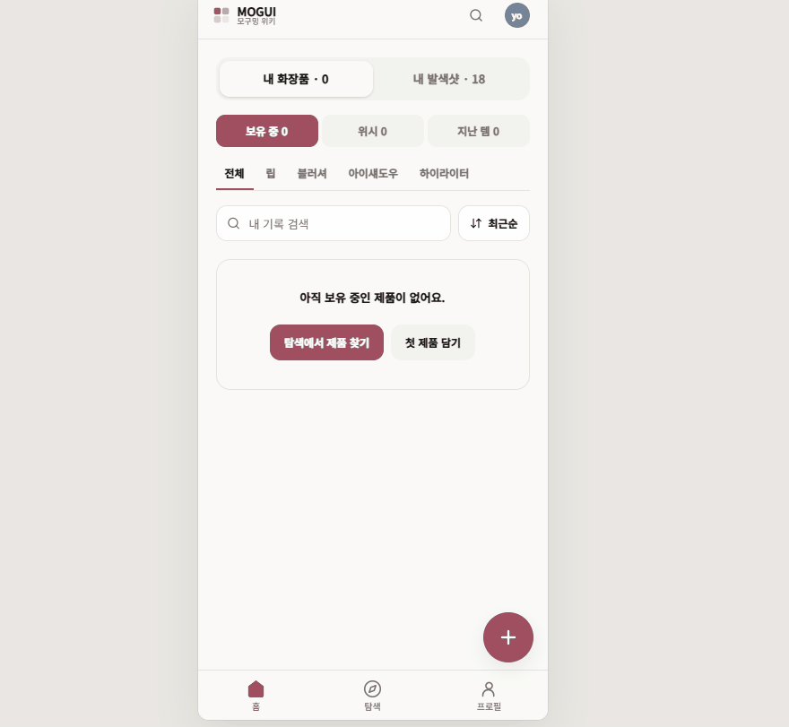
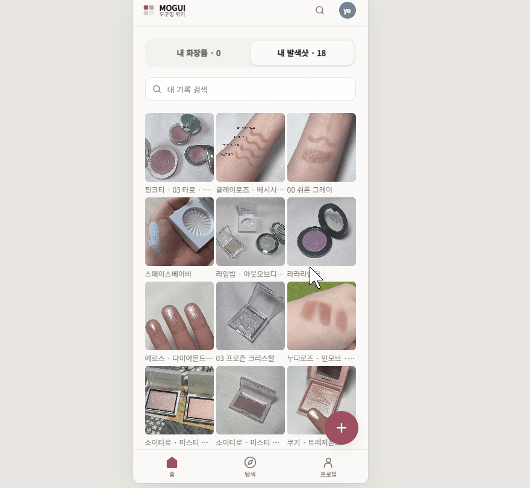
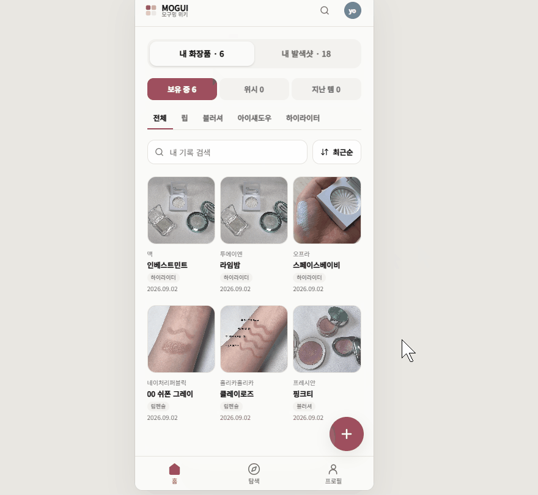
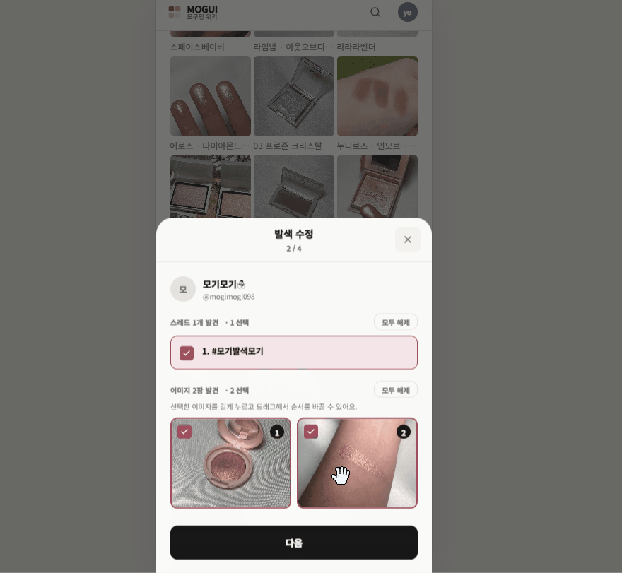
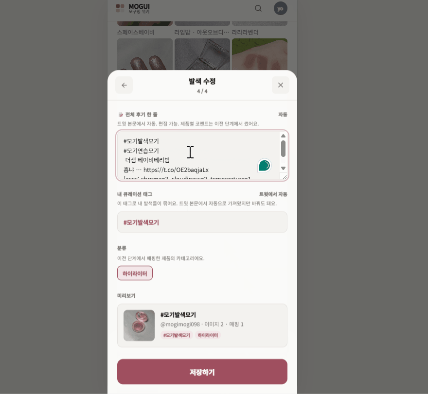

# PR #540 UAT — 홈 개인 아카이브 영상 UX 리뷰

## 왜 남기는가

PR #540 구현 뒤 모기가 홈의 `내 발색샷`을 훑고, 연결 제품을 보유함에 담고, 제품 메모·4축 평가·발색 게시물을 수정하는 과정을 녹화했다. 기능의 존재 여부보다 “기능은 되는데 전체가 왜 피곤한가”를 실제 행동과 화면 구조로 분리해 본 기록이다.

이 문서는 제품 구현의 SSOT가 아니다. 실행 항목과 확정 결정은 열린 운영 이슈와 `master-delivery-memos.md`로 별도 환류한다.

## 입력 자료와 판독 범위

- 원본: `540pr.gif`
- 로컬 보관 위치: `/mnt/c/Users/82109/Pictures/540pr.gif`
- 크기: 약 25MB
- 화면 크기: 880×811
- 길이: 132.22초
- 프레임 수: 1,426
- SHA-256: `e8a35e15200956caca5fb528559c998a202c6af3abea298d296dc0369fd3283b`
- 대화 원문: [`raw/2026-09-02-01-sw-ypn-pretty-notebook-tdd.md`](../raw/2026-09-02-01-sw-ypn-pretty-notebook-tdd.md)
- 출발 카드: [`plan-cards/2026-09-02-sw-ypn-shortcut-notebook-lead.md`](../plan-cards/2026-09-02-sw-ypn-shortcut-notebook-lead.md)

원본 GIF 25MB는 현재 공책 전체 크기보다 커서 Git에 복사하지 않았다. 아래 핵심 프레임 5장만 이 문서와 함께 보존한다.

## 이번에 쓴 분석 과정

1. 첨부 GIF가 기본 이미지 판독에서 첫 프레임만 보이는 한계를 먼저 확인했다.
2. 저장소 밖 임시 폴더의 GIF 디코더로 메타데이터를 읽고, 약 5초 간격 27개 지점으로 전체 흐름을 훑었다.
3. 빈 홈, 내 발색샷 그리드, 보유 전환 완료, 발색 수정 2단계와 4단계를 원본 크기로 다시 확인했다.
4. 먼저 `사용자가 한 행동과 화면 결과`만 시간순으로 적고, 그다음 반복·재확인·대상 전환 비용을 UX 해석으로 붙였다.
5. 화면만 보면 의미가 불명확했던 빈 상태 CTA 두 개와 전역 `+`, 상세 상단·하단 편집의 실제 대상을 읽기 전용 제품 코드로 대조했다.
6. 웹 ChatGPT 분석을 `강한 관찰 / 화면만 보고 한 오독 / 아직 검증되지 않은 해결안`으로 다시 분류했다.
7. 열린 운영 이슈와 현재 전달 메모를 확인해 신규 발견, 기존 이슈의 새 영향, 이미 알려진 문제를 구분했다.

판독 한계: 영상을 일반 플레이어로 처음부터 끝까지 연속 재생한 것이 아니라 전 프레임을 해독한 뒤 5초 간격으로 흐름을 잡고 중요 구간을 확대했다. 아래 초 단위는 정확한 계측값이 아니라 해당 행동을 확인한 근사 지점이다. 삭제 확인 흐름은 실제로 실행하지 않아 평가하지 않았다.

## 핵심 프레임

### 0초 — 발색 기록 18개가 있지만 빈 화장품이 홈 전체를 차지함



### 5초 — 내 발색샷은 사진보다 잘린 제품명 문자열에 의존해 찾아야 함



### 35초 — 여러 제품을 하나씩 열어 보유 중 6개로 만든 뒤



### 100초 — 기존 발색을 고치는데 등록 흐름의 2/4를 다시 통과



### 105초 — 본문 수정은 4/4에 도달해야 가능



## 관찰 사실

### 1. 빈 화장품이 값 있는 발색 아카이브보다 먼저 보임

첫 화면은 `내 화장품 · 0`을 선택한 상태다. `내 발색샷 · 18`이 있지만 홈 본문은 빈 화장품 메시지가 차지한다. 데이터가 없는데도 상태 3개, 카테고리 5개, 검색, 정렬이 먼저 노출되고, 빈 상태 CTA 두 개와 전역 `+`까지 동시에 보인다.

### 2. 한 발색과 연결된 여러 제품을 제품 상세에서 하나씩 보유 전환함

모기는 내 발색샷에서 제품 상세를 열고 각 제품의 `내 보관함에 추가`를 반복했다. 약 35초 지점에는 `보유 중 6`이 됐다. 보유 전환은 자동이 아니었지만, 한 발색에서 연결 제품을 한꺼번에 확인하고 명시적으로 고르는 표면도 없었다.

### 3. 같은 상세 안에 서로 다른 값의 편집이 함께 있음

상단 바는 한 제품의 보유 상태·메모를 관리한다. 아래 발색 카드의 `비공개 / 수정 / 삭제`는 한 발색 게시물을 관리한다. 두 영역이 같은 상세와 연필 언어를 사용해 사용자가 지금 제품 기록을 고치는지 발색 게시물을 고치는지 다시 판별해야 한다.

### 4. 발색 본문을 고치려면 등록 시트의 단계 흐름을 다시 밟음

발색 게시물의 수정은 `2/4`에서 트윗·사진 선택을 다시 확인하고 `4/4`로 이동해야 본문과 태그를 저장할 수 있다. 영상에서는 수정 진입부터 저장 뒤 상세 복귀까지 약 30초가 걸렸다.

### 5. 수정 저장 뒤 원래 상세로 복귀하는 동작은 유지 가치가 있음

저장 뒤 수정한 발색 카드가 있던 상세 문맥으로 돌아오고 `수정했어요` 피드백이 보였다. 수정 전용 화면을 만들더라도 이 복귀 계약은 유지할 가치가 있다.

## UX 해석

### 화면의 조작 레벨이 같은 언어로 보임

현재 홈에서는 앱 내부 영역 전환(`내 화장품 / 내 발색샷`), 제품 상태(`보유 중 / 위시 / 지난 템`), 카테고리 필터, 검색·정렬이 연속해서 나타난다. 논리적 층은 다르지만 모두 비슷한 탭·칩·버튼으로 보여 콘텐츠보다 조작 패널을 먼저 해석하게 한다.

### 두 기록이 분리돼 있으나 연결 행동은 부족함

제품별 소유 상태와 발색 게시물은 다른 기록이므로 자동으로 같은 것으로 취급할 수 없다. 그러나 한 발색에 매핑된 제품을 여러 번 열어야 하는 현재 흐름은 “의도를 분리한다”를 “반복 이동한다”로 구현하고 있다. 명시적 선택을 유지한 일괄 보유 전환이 둘 사이의 빠진 다리다.

### 수정이 새 등록처럼 행동함

신규 등록은 URL에서 트윗·사진·제품 매핑을 조립하는 단계형 작업이다. 수정은 이미 존재하는 게시물의 틀린 부분만 고치는 작업이다. 대상과 값이 정해져 있는데 등록 단계를 다시 확인하게 하면서 작은 수정이 큰 작업처럼 느껴진다.

## 웹 ChatGPT 피드백 재분류

### 영상과 코드가 함께 지지한 관찰

- 홈 상단에 서로 다른 의미의 조작층이 겹쳐 있다.
- 빈 상태에서도 검색·정렬·필터를 모두 해석해야 한다.
- `내 화장품 / 내 발색샷`은 단순 필터보다 서로 다른 관리 대상에 가깝다.

### 화면만 보고 한 오독이지만 사용성 증거가 된 부분

- `탐색에서 제품 찾기`는 탐색 탭으로 이동하고 `첫 제품 담기`는 범용 검색 시트를 연다. 같은 행동은 아니지만 카피만 보면 차이를 알기 어렵다.
- 전역 `+`는 제품 추가가 아니라 발색 등록을 연다. 아이콘만으로 동작 대상을 알기 어렵다.

### 아직 해결안 후보인 부분

- `내 화장품`과 `내 발색샷`을 반드시 별도 페이지로 분리해야 한다는 결론
- 홈에서 개수 요약과 최근 사진 중 어느 것을 더 먼저 크게 보여줄지

오독을 구현 사실로 채택하지는 않았지만, 외부 분석자가 화면만 보고 행동 대상을 잘못 짚은 것은 현재 UI가 뜻을 충분히 전달하지 못한다는 독립 증거로 사용했다.

## 모기와 확정한 것

### 발색 수정

- 등록 시트 재사용이 아니라 수정 전용 화면을 쓴다.
- 사진, 본문, 연결 제품 등 수정 가능한 현재 값을 한 화면에 펼친다.
- `다음` 버튼과 단계 전환 없이 필요한 곳만 고친 뒤 한 번 저장한다.
- 세부 선택기가 필요하면 같은 편집 화면에서 여는 보조 조작으로 둔다.
- 삭제는 편집 화면에 중복하지 않고 현재 상세시트의 삭제 버튼에 남긴다.

### 다중 보유 전환

- 발색 등록이 곧 제품 보유를 뜻한다고 자동 추론하지 않는다.
- 한 발색에 연결된 제품들과 현재 상태를 한 화면에 보여준다.
- 사용자가 원하는 제품을 명시적으로 고른 뒤 한 번 확인해 `보유 중`으로 전환한다.
- `지난 템`은 과거 상태를 되살리는 별도 확인을 유지한다.

## 홈 구조 후보 — 인터뷰 전 미확정

홈을 두 목록을 번갈아 끼우는 화면보다 개인 아카이브 대시보드로 바꾸는 후보가 나왔다.

```text
홈 — 내 아카이브

[내 화장품 6 ›]   [내 발색샷 18 ›]

최근 기록
[발색 사진] [발색 사진] [발색 사진]   전체 보기 ›

내 기록에서 이어보기
[최근 본 제품] [같은 계열 색] [연결된 다른 제품]
```

- `내 화장품` 안에서만 보유 중·위시·지난 템, 카테고리, 검색·정렬을 보여준다.
- `내 발색샷` 안에서만 발색 검색·필터·그리드와 관리 행동을 보여준다.
- 홈의 파도타기는 세상 전체가 아니라 `내 기록에서 이어보기`로 시작한다.
- 탐색 탭은 낯선 제품과 색을 처음부터 구경하는 공간으로 구분한다.

모기는 개수 요약과 최근 사진을 모두 중요하게 느꼈다. 둘 중 하나를 제거하지 않고 어느 쪽에 첫 시각적 무게를 둘지는 이번 주 업계 종사자·코덕 인터뷰에서 확인한다.

## 인터뷰에서 확인할 장면

순서만 다른 두 화면을 보여준다.

- A: 화장품·발색 개수 요약 → 최근 사진
- B: 최근 사진 → 화장품·발색 개수 요약

선호를 먼저 묻기보다 아래 과업에서 첫 시선·첫 클릭·멈칫을 본다.

1. “예전에 올린 발색을 다시 찾으려면 어디부터 누를 것 같아요?”
2. “지금 가진 화장품을 확인하려면요?”
3. “이 화면에서 이것저것 구경하고 싶다면 어디로 갈 것 같아요?”

한 명의 답으로 구조를 확정하지 않고, 모기의 실제 사용 마찰과 같은 방향인지 확인하는 증거로 쓴다.

## 운영 환류 지도

| 발견·결정 | 현재 자리 |
|---|---|
| 발색 수정 전용 단일 화면 | 열린 이슈 `sw-ek3v` + 전달 메모 델타 |
| 발색 그리드 라벨 가독성 | 열린 이슈 `sw-andi` (`sw-ykw` 관련) |
| 결과 0 필터의 사전 단서 | 열린 이슈 `sw-ck3` |
| 한 발색→연결 제품 다중 보유 전환 | `master-delivery-memos.md` 신규 발견 |
| 빈 홈의 조작층·CTA·FAB 의미 | `master-delivery-memos.md`, `sw-ck3`과 다른 영향으로 기록 |
| 홈 개인 아카이브 대시보드 | 인터뷰 뒤 결정할 후보, 아직 발주하지 않음 |
| 제품 상세의 과거 내 발색 노출·지름길 | 인터뷰 뒤로 유보 |

## 다음 리뷰에서 재사용할 최소 절차

```text
사용 과업과 원본 고정
→ 전체 흐름을 중립적으로 훑고 시간대별 행동 기록
→ 반복·왕복·재확인·멈칫 구간 확대
→ 각 조작이 어느 기록을 바꾸는지 확인
→ 관찰과 해석 분리
→ 해결안은 후보·확정·인터뷰 대기로 구분
→ 열린 이슈 중복 확인 후 마스터 경로로 환류
```

다른 영상에서도 이 절차가 유용한지 본 뒤에만 영구 가이드로 승격한다.
